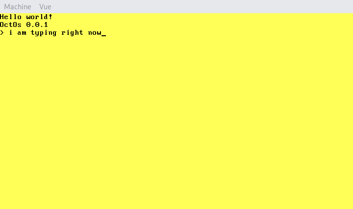

# OctOs
An OS created in October. This OS is 32 bits, provides a heap and a command line interface.




## Features
- Pure bootloader (no GRUB).
- 32 bits, protected mode.
- Custom standard library.
- Command line interface.
- Heap.
- (WIP) Error handling.
- (WIP) Commands.

## Standard Library
This os provides a custom standard library located in src/kernel/std, here is files :
- types : System types
- io : Input / Output
- mem : Memory handling
- err : Error handling

## Architecture
- utils : Some scripts.
- src : Source files.
- src/boot : Boot source files (Assembly).
- src/kernel : Kernel source files (C).
- src/kernel/std : Standard library.

## Build
Here is makefile commands. To build :
```bash
$ make
```
To build and run :
```bash
$ make run
```
To remove temporary files :
```bash
$ make flush
```
To clean everything (removes all build files) :
```bash
$ make clean
```

## Depedencies
To build the OS you must have :
- nasm : Assembly sources.
- python3 : Scripts in the utils folder.
- cc (for i386, provided with GCC) : For C sources.
- ld (for i386, provided with GCC) : To link object files.

If the compilation fails, please make sure that you have a cross compiler (for i386).
Here is some [documentation](https://wiki.osdev.org/GCC_Cross-Compiler "Build a cross compiler") about how to build a cross compiler. 

## Links
Here are some usefull links :
- [VGA reference](http://www.osdever.net/FreeVGA/vga/crtcreg.htm "VGA")
- [Keycodes reference](http://www.vetra.com/scancodes.html "Keycodes")
- [Linux Kernel](https://github.com/torvalds/linux "Linux")
- [OsDev](http://www.osdever.net/FreeVGA/vga/crtcreg.htm "OsDev")
- [Developpez (French)](https://systeme.developpez.com/tutoriels/systeme-exploitation/petit-livre-developpement-OS/ "Developpez")